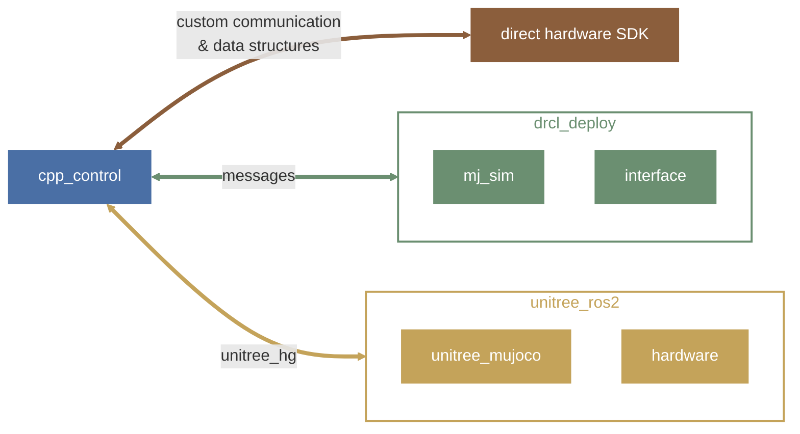
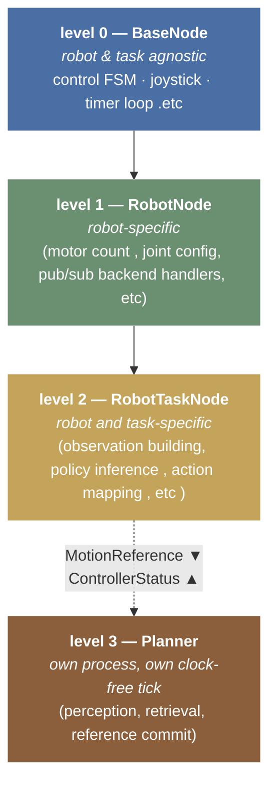

# ethos

design + figures for cpp_control. usage lives in the [readme](../readme.md).

## backends

one controller package, three ways to talk to a robot:



backends compile in conditionally (`HAS_UNITREE_HG`, `HAS_MESSAGES`); the yaml
`workflow:` field picks one at runtime.

## four levels



levels 0-2 are **inheritance**; level 3 is a **topic wire**. a planner is a
separate process at a separate rate, so the controller stays runnable — and
shippable — with no planner attached.

| level | class | owns |
|---|---|---|
| 0 | `BaseNode` | control-mode FSM (zeroing / damping / nominal / stand / policy), joystick, timer loop |
| 1 | `G1Node`, `MiniPiNode` | joint config, message backends, gamepad, robot-level stand engine |
| 1.5 | `G1TextopTrackerNode` | motion streaming + WBC obs, shared by trackers that ride the topic wire |
| 2 | task nodes | obs building, inference, action mapping |
| 3 | planners (`planners/<task>/`) | perception, retrieval, which reference to commit next |

## control modes

```
ZEROING --X--> NOMINAL_POSE (PD interp to default) --A--> POLICY
   |                                                      ^
   B/Y (zero/damp from anywhere)                          | A
   |                                                      |
   +------RB-----> STAND (g1::SonicStand, active balance)-+
```

`STAND` is robot-level: any g1 controller gets it from one yaml field
(`stand_onnx_path` → a base-SONIC export). Tasks with their own stand
semantics (sonic tracker, textop) simply don't set it.

## the shared spine (`common/`)

| piece | one-liner |
|---|---|
| `g1/joint_orders.hpp` | IL/MJ tables built from name lists — the only joint-order truth |
| `g1/motion.{hpp,cpp}` | the one motion container + clock — [docs/motion.md](motion.md) |
| `g1/sonic_stand.{hpp,cpp}` | robot-level stand kernel over a base-SONIC export |
| `deploy_manifest` + `onnx_session` | manifest-driven serving — [docs/onnx_policies.md](onnx_policies.md) |
| `obs_terms.hpp` | `HistoryTerm` (mjlab CircularBuffer semantics) |
| `math_utils.hpp` | wxyz quat algebra, projected gravity, 6D rotations, frame math |

## codebase structure

```
cpp_control/
├── config/<task>/<robot>.yaml      # plumbing only — checkpoints carry their own truth
├── include/
│   ├── common/                     # shared spine (see table above)
│   └── cpp_control/
│       ├── base.hpp                # level 0
│       ├── robots/<robot>.hpp      # level 1
│       ├── tasks/<task>/<robot>.hpp# level 2
│       └── planners/<task>/         # level 3 — g1-only, so flat (no <robot>)
├── src/                            # mirrors include/
├── launch/<robot>_<task>.launch.py
├── models/<task>/                  # dropped-in artifacts (untracked)
├── scripts/<family>/               # viewers + publishers (python), flat install names
├── tests/deploy_selftest.cpp       # infra unit checks, no gtest
└── docs/                           # this folder
```

## adding a robot / task

1. robot: inherit `BaseNode` → `robots/<robot>.{hpp,cpp}`, register a static
   lib in CMakeLists (follow `cpp_control_g1`).
2. task: inherit the robot node → `tasks/<task>/<robot>.{hpp,cpp}` +
   `config/<task>/<robot>.yaml` + `launch/<robot>_<task>.launch.py` +
   executable in CMakeLists.
3. prefer the manifest stack for new policies
   ([docs/onnx_policies.md](onnx_policies.md)) — zero hand-counted dims.
4. planner: it does **not** inherit anything. `planners/<task>/` + a ROS-free
   algorithm lib + one thin node + `config/<task>_planner/<robot>.yaml` +
   `launch/<robot>_<task>_planner.launch.py`. Talk to the controller only over
   `MotionReference` / `ControllerStatus`, and keep the algorithm ROS-free so a
   selftest can replay it with no robot — see
   [docs/planners/repose/](planners/repose/planner.md).
