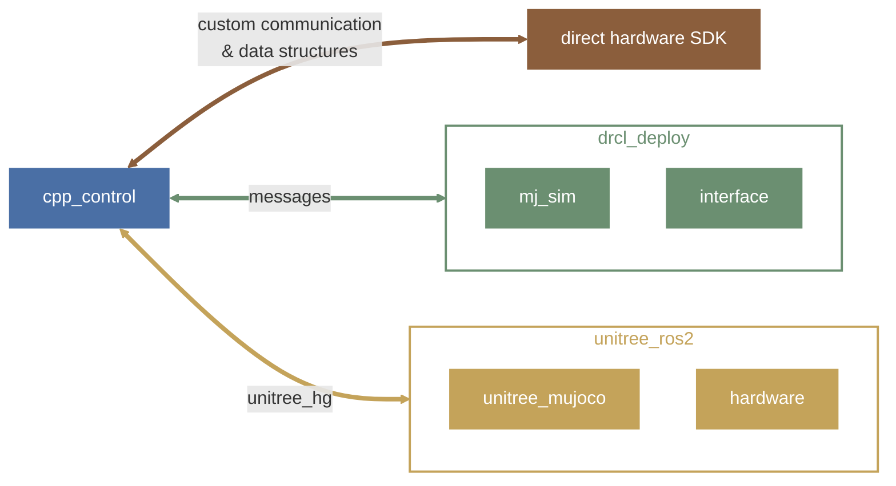
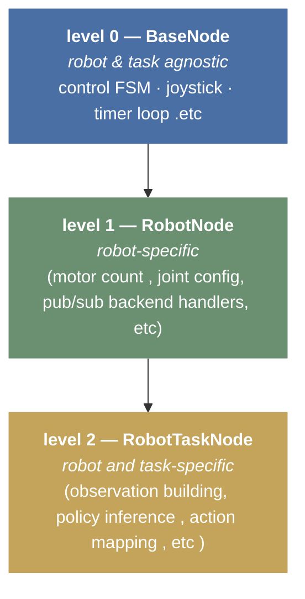

# cpp_control

a modular, multi-robot, multi-workflow C++ controller deployment package for ROS2.

developed and tested in ROS2 [humble](https://docs.ros.org/en/humble/index.html)



## install

refer to corresponding deployment workflow:
*  [unitree.md](workflows/unitree.md) 
*  [drcl_deploy.md](workflows/drcl_deploy.md)

**onnx** (optionally, for nn controllers)
* download pre-built [ONNX Runtime v1.22](https://github.com/microsoft/onnxruntime/releases/tag/v1.22.0)
* put a symbolic link under [thirdparty](./thirdparty/)
```
ln -s /PATH/TO/onnxruntime-linux-x64-1.22.0 ./cpp_control/thirdparty/
```

## usage

```bash
# G1 locomotion
ros2 launch cpp_control g1_locomotion.launch.py

# Custom ONNX model
ros2 launch cpp_control g1_locomotion.launch.py onnx_model_path:=/path/to/model.onnx

# MiniPi locomotion
ros2 launch cpp_control mini_pi_locomotion.launch.py

# MiniPi dive / flip
ros2 launch cpp_control mini_pi_dive.launch.py
```


## dev guide

The package follows a **three-level inheritance** pattern that cleanly separates concerns:



### codebase structure

```
cpp_control/
├── 📁 config/<task>/
│   └── ⚙️ <robot>.yaml
├── 📁 include/
│   ├── 📁 common/                  # shared types, math, obs utils
│   └── 📁 cpp_control/
│       ├── 📄 base.hpp             # level 0
│       ├── 📁 robots/
│       │   └── 📄 <robot>.hpp      # level 1
│       └── 📁 tasks/<task>/
│           └── 📄 <robot>.hpp      # level 2
├── 📁 src/                         # mirrors include/
├── 📁 launch/
│   └── 🐍 <robot>_<task>.launch.py
├── 📁 models/<task>/
│   └── 🧠 <robot>.onnx
└── 📄 CMakeLists.txt
```

### adding a new robot

1. **create robot node** — inherit from `BaseNode`:

   ```
   include/cpp_control/robots/<robot>.hpp
   src/robots/<robot>.cpp
   ```

2. **register in CMakeLists.txt** — add a static library following the `cpp_control_g1` pattern.

>[!TIP]
> refer to
> * [robots/g1.hpp](include/cpp_control/robots/g1.hpp) 
> * [robots/g1.cpp](src/robots/g1.cpp)

---

### adding a new task

1. **create task node** — inherit from the robot's Level 1 node:

   ```
   include/cpp_control/tasks/<task>/<robot>.hpp
   src/tasks/<task>/<robot>.cpp
   ```

2. **add config** — `config/<task>/<robot>.yaml`

3. **add ONNX model** — `models/<task>/<robot>.onnx`

4. **add launch file** — `launch/<robot>_<task>.launch.py`

5. **register in CMakeLists.txt** — add executable following existing patterns.

>[!TIP]
> refer to
> * [tasks/locomotion/g1.hpp](include/cpp_control/tasks/locomotion/g1.hpp) 
> * [tasks/locomotion/g1.cpp](src/tasks/locomotion/g1.cpp)

---


